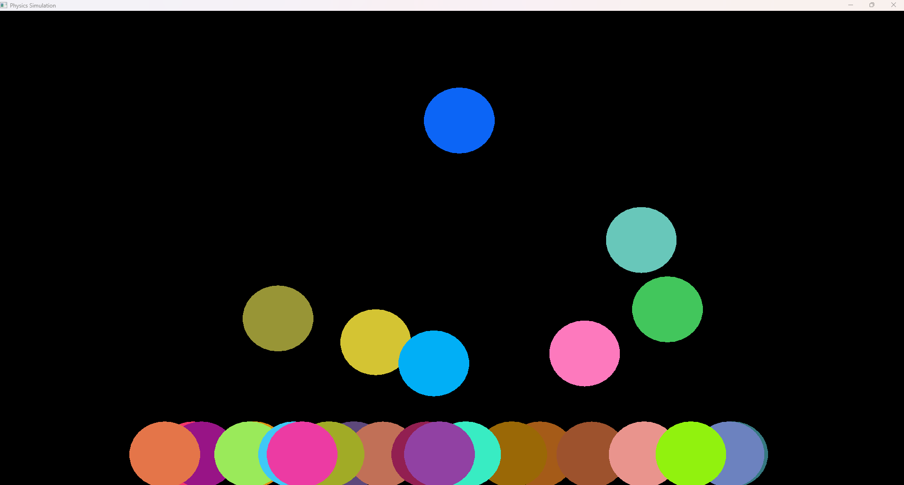

## Physics Simulation With C++ - SFML - ImGui
This project is made for try to replicate physics with c++ and SFML.

### Functions Introduced:
- Spawning of balls
- Gravity (only of the earth at the moment)
- Bouncing

